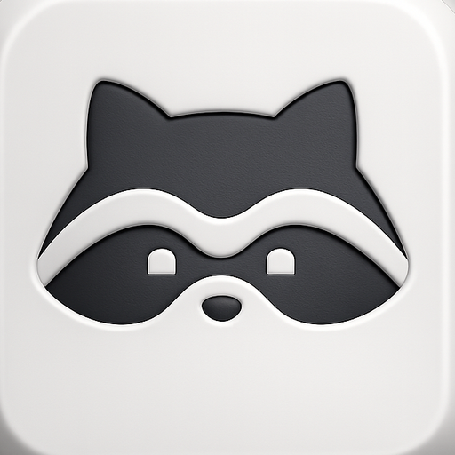
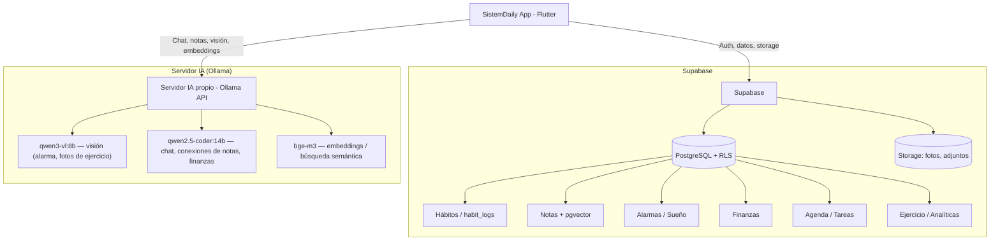

<p align="center">
  
</p>

<h1 align="center">SistemDaily</h1>
<p align="center"><b>Life OS personal</b> — hábitos, notas, finanzas, agenda, ejercicio y más, con IA local y privada.</p>

---

SistemDaily es una app Flutter (Android / iOS / escritorio / web) que funciona como un **segundo cerebro personal**: centraliza hábitos, notas interconectadas, finanzas, agenda, lectura, ejercicio y analíticas en un solo lugar, con un sistema de alarmas anti-procrastinación validadas por visión artificial.

Todo el procesamiento de IA (chat, conexiones entre notas, validación de fotos, embeddings) corre en un **servidor propio con Ollama** — nada de datos personales sale hacia proveedores externos de IA.

---

## 🧩 Funcionalidades

### ✅ Hábitos
Seguimiento de hábitos con heatmap estilo GitHub, rachas, categorías y plantillas rápidas. Historial persistido en `habit_logs` para ver evolución a largo plazo.

### 🧠 Notas (Segundo Cerebro)
Editor estilo Notion, grabación de voz, y un **grafo de conocimiento interactivo** que conecta notas semánticamente mediante embeddings (`bge-m3`, pgvector) — sin depender de etiquetas manuales. Incluye recordatorios y notas con autodestrucción.

### ⏰ Alarma anti-procrastinación
Alarmas reales (múltiples, por días de la semana, con objetos personalizados) que solo se desactivan validando una foto con un **modelo de visión (`qwen3-vl`)** — por ejemplo, fotografiar la cocina hecha o el escritorio ordenado. Incluye diagnóstico de notificaciones, panel de sueño y "wake check" (comprobación de que sigues despierto).

### 💰 Finanzas
Gestor de dinero en USD con cuentas, transacciones y entrada asistida por IA (describe el gasto en lenguaje natural y la app lo estructura).

### 💬 Copiloto (Chat)
Chat con memoria persistente, múltiples conversaciones y una persona de experto financiero, con contexto inyectado automáticamente desde hábitos y notas. RAG con streaming sobre el grafo de notas.

### 🗓️ Agenda
Planeación nocturna con timeline arrastrable, tareas vinculadas a hábitos y un ritual guiado de 5 pasos para cerrar el día y planear el siguiente.

### 📚 Biblioteca
Lector integrado de EPUB y PDF con texto a voz (TTS), posición de lectura persistida y recepción de libros compartidos desde otras apps.

### 📰 Noticias
Digest de noticias generado por un cron en el servidor propio + Ollama, entregado como resumen diario.

### 📊 Analíticas
Métricas derivadas de hábitos, finanzas, sueño y ejercicio sin necesidad de SQL adicional: correlaciones por tercios y revisión semanal.

### 🏃 Ejercicio
Registro de running (integración con Strava) y fotos de progreso físico validadas/organizadas con IA, con galería, estadísticas y zoom sobre la ruta.

### 🎮 Mi Personaje (RPG)
Un sistema de gamificación con 5 héroes en pixel art que evolucionan por nivel, bazar de cosméticos y 14 logros con badges y puntos ganados por hábitos, alarma, finanzas y notas.

### 🔒 Bóveda (Vault)
Almacén cifrado de datos sensibles protegido con biometría/PIN (`local_auth`), cifrado local con `encrypt` y `flutter_secure_storage`.

### ⚡ Captura rápida
Widget de escritorio / tile de notificaciones para capturar notas y tareas sin abrir la app completa.

### ⏱️ Pomodoro
Temporizador con "modo monje" (paneles solo visibles durante el descanso, para minimizar distracción) y estadísticas locales.

### 🎨 Personalización
Tema neumórfico propio (claro/oscuro) con paleta de colores configurable por el usuario.

### 🔄 Auto-actualización
Comprobación e instalación de nuevas versiones directamente desde releases de GitHub, sin pasar por una tienda de apps.

---

## 🏗️ Arquitectura del Sistema



---

## 🖥️ Servidor de IA (Ollama)

*   **Host**: `63.141.255.7:11434`
*   **Hardware**: Intel Xeon E5-2697 v3, 125 GiB RAM, NVIDIA Tesla V100 (16 GB VRAM, CUDA 13.0)
*   **Modelos**:
    | Modelo | Uso |
    |---|---|
    | `qwen2.5-coder:14b` | Chat, razonamiento, conexiones de notas, digest de noticias |
    | `qwen3-vl:8b` | Validación visual (alarma, fotos de ejercicio) |
    | `bge-m3:latest` | Embeddings para búsqueda semántica (pgvector) |

`LocalAIClient` (`lib/core/network/local_ai_client.dart`) habla con `/api/chat` de Ollama y cae automáticamente a un endpoint compatible con OpenAI (`/v1/chat/completions`) si el servidor es LM Studio, vLLM, etc.

---

## 🎨 Diseño: Bento / Neumorfismo

La interfaz usa un sistema neumórfico propio en modo claro y oscuro, sin gradientes:

*   `BentoTheme.primaryDark` (`#27187E`) — color primario / texto
*   `BentoTheme.bgLight` (`#F7F7FF`) — fondo del scaffold
*   `BentoCard` / `BentoBackground` — contenedor con borde suave y wrapper con safe area
*   Acentos por sección: naranja, azul, púrpura, lima, etc.
*   Fuente: **Outfit** (Google Fonts)
*   La luz de las sombras neumórficas siempre viene de arriba-izquierda; en listas se usan variantes "lite" (`NeuPressed(lite)`, `neuRaisedLite`) para evitar el coste de renderizar múltiples pasadas de blur offscreen.

---

## 📁 Estructura del Proyecto

```text
lib/
├── main.dart                     # Bootstrap, providers globales, deep links y entry point de captura rápida
├── core/
│   ├── theme/                    # Paleta Bento/neumórfica, OKLCH
│   ├── network/                  # Cliente Ollama (local_ai_client.dart)
│   ├── providers/                # Riverpod: settings, hábitos, alarmas, sueño, agenda, ejercicio...
│   ├── services/                 # Notificaciones, sincronización offline, alarmas, recordatorios
│   ├── models/                   # Modelos de datos (AppDestination, alarmas, etc.)
│   ├── utils/ y widgets/         # Utilidades y widgets compartidos
└── features/
    ├── habits/                   # Hábitos + heatmap
    ├── notes/                    # Segundo cerebro: editor + grafo de conocimiento
    ├── alarm/                    # Alarma anti-procrastinación + sueño
    ├── finance/                  # Gestor de dinero
    ├── chat/                     # Copiloto conversacional
    ├── agenda/                   # Planeación nocturna + timeline
    ├── reading/                  # Lector EPUB / PDF + TTS
    ├── news/                     # Digest de noticias
    ├── analytics/                # Métricas y revisión semanal
    ├── exercise/                 # Running + fotos de progreso
    ├── character/                # RPG: héroes, cosméticos, logros
    ├── vault/                    # Bóveda cifrada
    ├── quick_capture/            # Widget/entry point de captura rápida
    ├── pomodoro/                 # Temporizador modo monje
    ├── settings/                 # Personalización de tema
    ├── update/                   # Auto-actualización
    ├── auth/                     # Login / sesión
    └── dashboard/                # Contenedor de pestañas y menú
```

Pestañas del dashboard, en orden: **Hábitos · Notas · Alarma · Finanzas · Copiloto · Agenda · Biblioteca · Noticias · Analíticas · Ejercicio** — más accesos a *Mi Personaje*, *Personalizar* y *Buscar actualizaciones* desde el menú lateral.

### Base de datos

Definida en `supabase_schema.sql` (+ migraciones sueltas para agenda, ejercicio y noticias). Todas las tablas usan RLS con políticas por usuario; un trigger crea el `profile` automáticamente al registrarse.

---

## 🚀 Ejecución

```bash
# El SDK de Flutter vive en una ruta fija del proyecto
/home/jhon/Documentos/TerminalAgent/sdk/flutter/bin/flutter pub get
/home/jhon/Documentos/TerminalAgent/sdk/flutter/bin/flutter run
```

1. Al abrir la app por primera vez verás la pantalla de configuración (`SetupScreen`). Completa:
   *   **Supabase URL** y **Anon Key** de tu proyecto.
   *   **URL del servidor de IA**: `http://63.141.255.7:11434`
   *   **Modelo de texto**: `qwen2.5-coder:14b`
   *   **Modelo de visión**: `qwen3-vl:8b`
2. Prueba la conexión con el botón de rayo antes de guardar.
3. Si ya hay sesión guardada, la app entra directo al `DashboardScreen`.

```bash
# Analizar (lint)
/home/jhon/Documentos/TerminalAgent/sdk/flutter/bin/flutter analyze

# Tests
/home/jhon/Documentos/TerminalAgent/sdk/flutter/bin/flutter test
```
</content>
